# QRPlate

The QRPlate is a system made to enahance the ALU Dining Management process, a web and mobile-based solution designed to streamline the dining experience at the African Leadership University.
By leveraging QR code technology, this system automates student attendance tracking, minimizes long queues, and eliminates issues related to manual ticketing. This document serves as the foundational guide for the project throughout the course.


## Goals and Objectives

### Overall Goal

Develop a comprehensive web and mobile application to automate and enhance ALU's dining management.


### SMART Objectives 

- Specific: Implement a QR code-based system for attendance tracking and ticket validation.

- Measurable: Achieve a 40% reduction in average queue time within the first semester.

- Achievable: We plan to use popular frameworks like Django for our backend and Flutter for our mobile development. Their proven reliability means we can build a solid, user-friendly solution while keeping development smooth and efficient.
Relevant: Directly address operational challenges affecting students and staff.

- Time-bound: We plan to complete the design, development, testing, and deployment of our solution by the end of the current academic term, ensuring we stay on schedule and deliver a complete solution within the set timeframe.

### 4. Scope of Work

| Team Member | Role | Responsibilities |
|------------|------|-----------------|
| Bonaparte Uteramahoro | Mobile App Development | • Design and develop mobile application using Flutter<br>• Implement responsive UI/UX design patterns<br>• Ensure cross-platform compatibility<br>• Optimize mobile app performance<br>• Implement offline functionality and local storage |
| Anjeline Noel | System Development & Security Lead | • Design and implement database architecture<br>• Manage system security protocols<br>• Handle server deployment and hosting<br>• Implement authentication systems<br>• Ensure data integrity and protection<br>• Optimize database performance |
| Uwambaje Eddy | Web App Frontend Lead | • Develop great web interface<br>• Implement modern frontend frameworks<br>• Create interactive UI components<br>• Ensure cross-browser compatibility<br>• Optimize web application performance<br>• Integrate frontend with backend APIs |
| Birenzi David | System Development & Backend Lead | • Develop core backend infrastructure<br>• Implement security measures<br>• Design and maintain API endpoints<br>• Manage database architecture<br>• Handle server deployment and hosting<br>• Ensure system scalability |

### Deliverables:
#### Web and mobile apps
- Database
- admin dashboard
- deployment setup
- Usage Manuals

### Tools Used:

1. BACKEND: DJANGO(PYTHON) 

2. FRONTEND: HTML, CSS (FLUTTER FOR MOBILE)

3. DATABASE: SQLITE 

4. API: DJANGO REST FRAMEWORK

5. LIBRARIES - PYTHON QR CODE LIBRARY


### Components:

The system comprises the following components:

#### User Registration


Students sign up to appear on the dining list.
User details are saved in the database.
OTP verification for authentication (during login).

#### QR Code Generation


A unique QR code ID is generated for each user.
Users can fetch their QR ID through the system.
Admin Dashboard


### Summary:

User friendly summary/overview of attendance tracking of students who attended and who didn't for fast and eased tracking

### Payment Validation & Detailed Information on Attendance

- Payment Validation for Non-scholar students
- Filtering functionalities for eased tracking

### Report Generation:
- For Administrative or Business analysis tasks

### Attendance:

- Scanning capability for the admin at the cafeteria

### Issue Flagging:

- Space to report an issue

## Authentication & Security

- Login system with OTP verification.
- Data encryption and secure storage.

## System Design Representational Graph

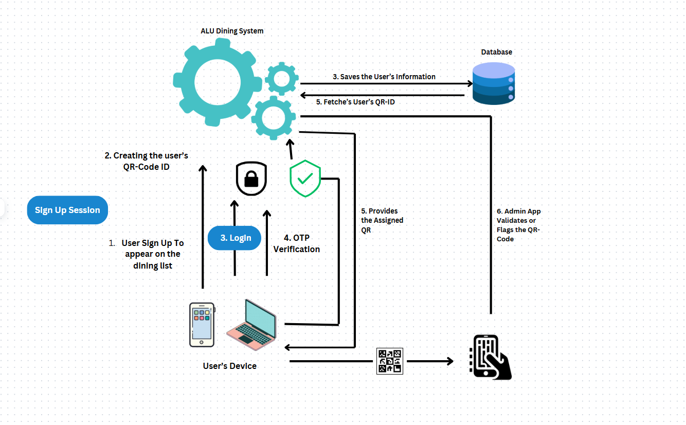


## Database Overview

Tables Included and Explanations

1. AttendanceUserprofile

   - This is the main user profile table
   - Stores student information like:
     Student ID
     Contact details (email, phone)
     Name (first and last)
     QR code for attendance
     Payment status (paid)
     Access status (blocked)
   - Links to the main Django user system (AuthUser)

2. AttendanceAttendance

   - Records when students attend
   - Stores:
   Date of attendance
   Time of attendance
   Which student attended (links to UserProfile)
   - Used to track student presence

3. AttendanceIssue

   - For reporting problems or concerns
   - Contains:
     Title and description of the issue
     Priority level
     When it was created
     Who reported it
   - Helps manage student complaints or problems

4. AuthUser (Django's built-in user system)

   - Main user account information
   - Stores:
     Login credentials
     Basic user info
     Staff/admin status
     Account status (active/inactive

5. Django System Tables

   -  DjangoSession: Manages user login sessions
   -  DjangoAdminLog: Tracks changes made in admin panel
   -  DjangoContentType: Helps Django identify different types of data
   -  DjangoMigrations: Tracks database structure changes

6. Authentication Related Tables

   - AuthGroup: For grouping users (like "Students", "Staff")
   - AuthPermission: Defines what users can do
   - AuthGroupPermissions: Links permissions to groups
   - AuthUserGroups: Links users to their groups
   - AuthUserUserPermissions: Individual user permissions

7. SQLite System Tables(can ignore these)

   - SqliteStat1 and SqliteStat4: Internal SQLite database statistics

## Database Design Representational Graph

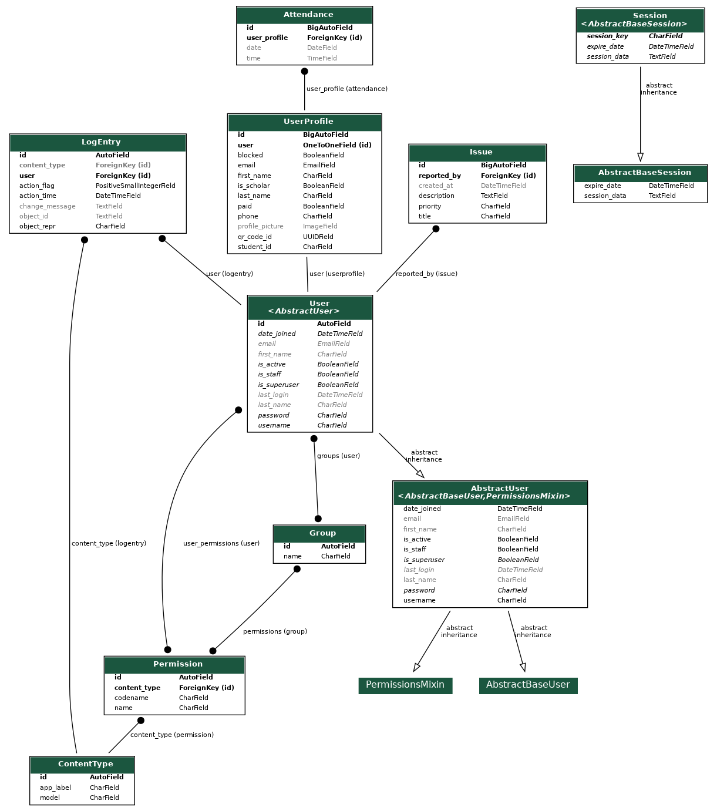

# How To Run The QRPlate?

## Prerequisites(locally)
- Python 3.x
- pip (Python package manager)
- Flutter SDK (for mobile app)
- Git
- ngrok (optional) for exposing the localhost to internet


## Backend Setup (Django)
1. Clone the repository
```bash
git clone [https://github.com/Bonaparte003/QRPlate.git]
cd QRPlate/QR_Backend
```

2. Create and activate virtual environment
```bash
python -m venv venv
source venv/bin/activate
```

3. Install dependencies
```bash
pip install -r requirements.txt
```

4. Setup database
```bash
python manage.py makemigrations
python manage.py migrate
```
5. Expose the system to the internet
```bash
ngrok http :8000
```
6. Update your django settings file to include the url provided by ngrok
```python

ALLOWED_HOSTS = ['localhost', '127.0.0.1', '226b-105-178-46-178.ngrok-free.app'] # Include your ngrok URL

CSRF_TRUSTED_ORIGINS = [
    'https://226b-105-178-46-178.ngrok-free.app'  # Replace with your actual Ngrok URL
]

BASE_URL = "226b-105-178-46-178.ngrok-free.app" # Replace with your actual Ngrok URL

```

7. Create superuser (admin)
```bash
python manage.py createsuperuser
```

8. Run the server
```bash
python manage.py runserver
```

9. Use the ngrok provided url

10. Update the flutter urls with the ngrok url to make secured requests

## Mobile App Setup (Flutter)
1. Navigate to mobile app directory
```bash
cd /QRApps/qrplate
cd /QRApps/qrplate_admin
```

2. Get Flutter dependencies
```bash
flutter pub get
```

3. Run the app
```bash
flutter run
```

## Accessing the Application
- Backend Admin Panel: http://localhost:8000/admin
- API Documentation: http://localhost:8000/api/docs
- Mobile App: Run on emulator or physical device

## Important Notes
- Make sure to create an account on ngrok
- Make sure all required services are running before using the application
- Default admin credentials should be changed after first login
- Configure environment variables if necessary

## DEMO

### Web Application

#### Authentication

*Login page for web application*

#### Admin Dashboard
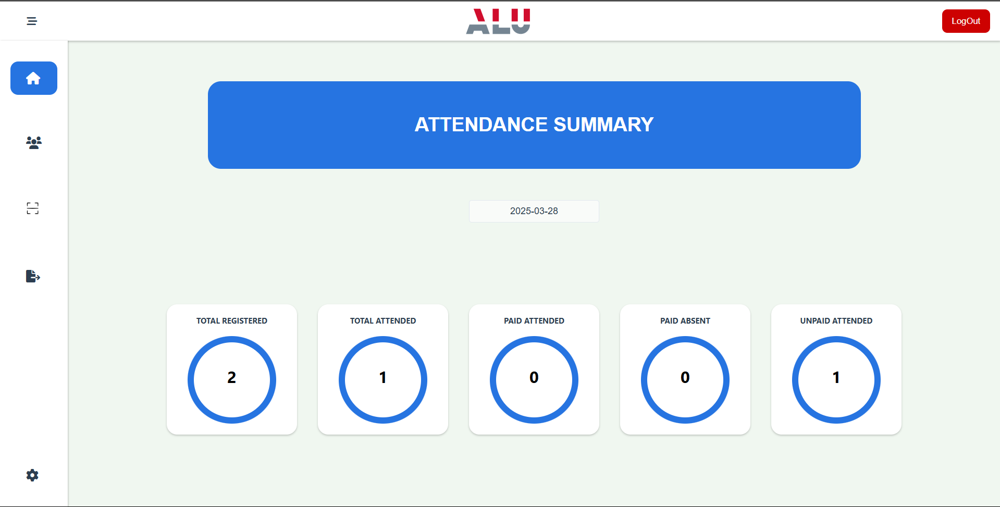
*Admin dashboard home page*

##### Student Management
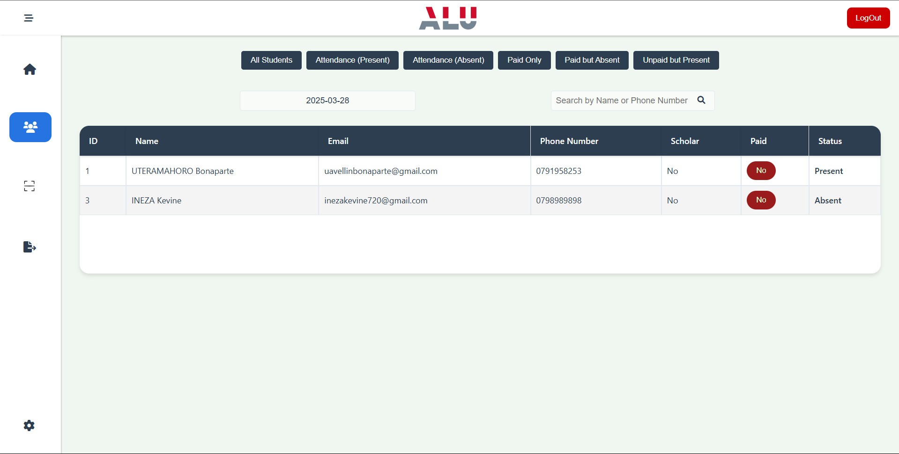
*View and manage students*

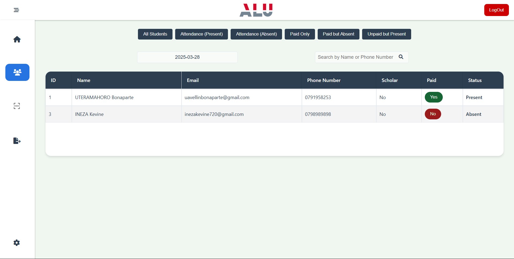
*Update student payment status*

##### Attendance Management
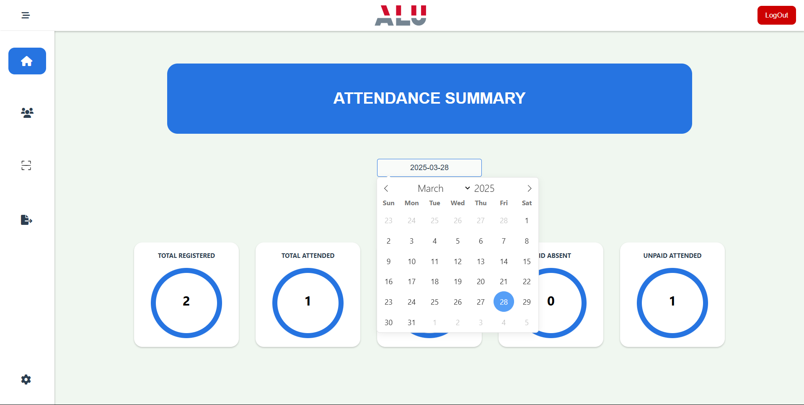
*Filter attendance by date*

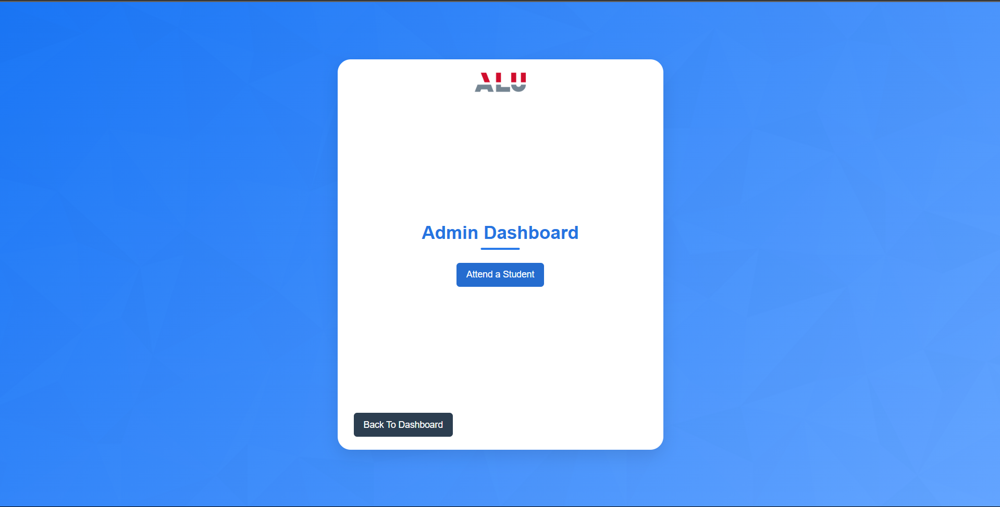
*Scan QR codes for attendance*

##### Permissions & Reports
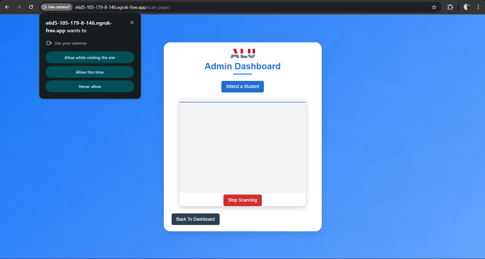
*Camera permission request*

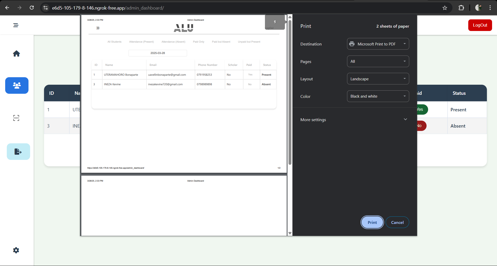
*Download attendance reports*

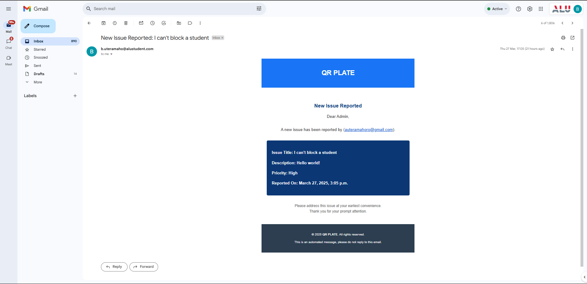
*Sample of email report*

#### Student Portal
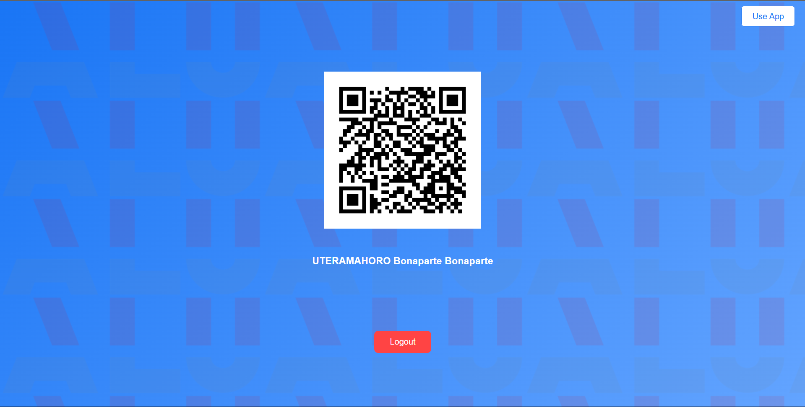
*Student dashboard with QR code*

### Mobile Applications

#### Student App

*App splash screen*

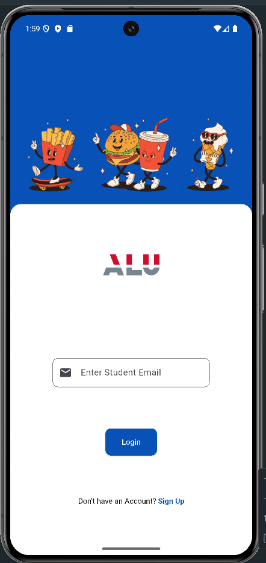
*Student mobile login*

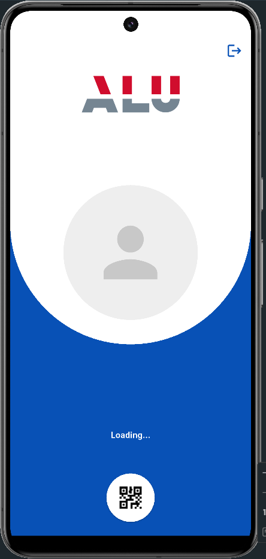
*Loading student information*


*Student home screen*

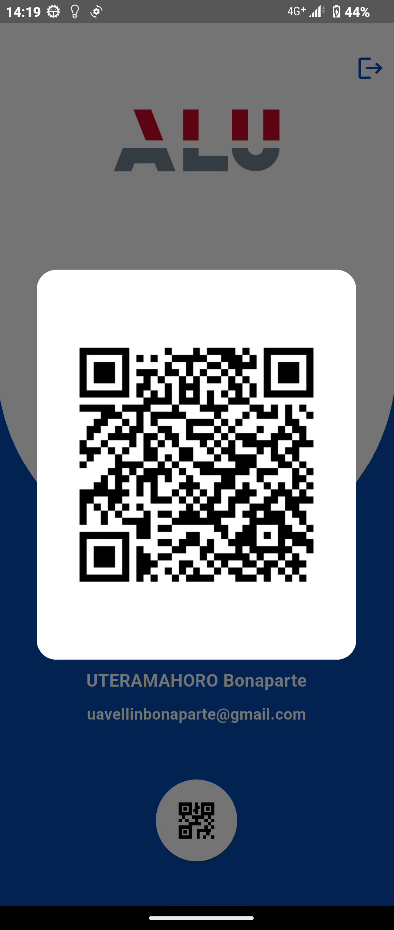
*Student QR code display*

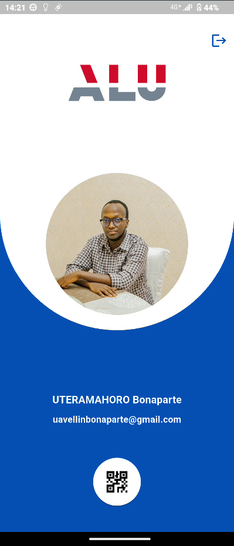
*Upload profile picture*

#### Admin App
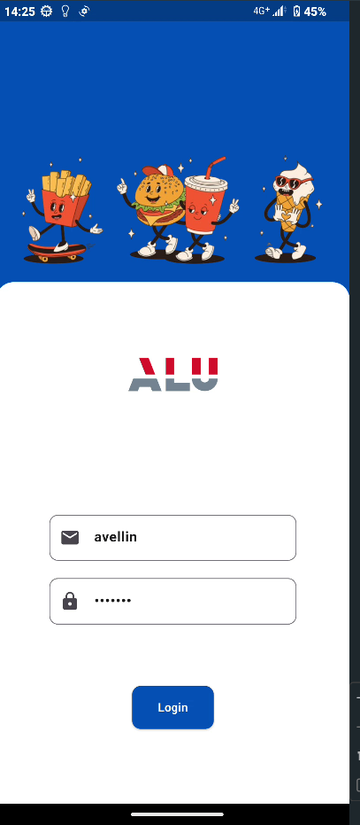
*Admin mobile login*

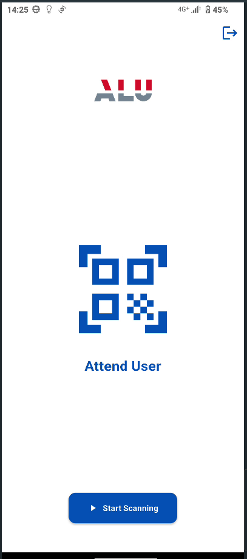
*Admin mobile dashboard*

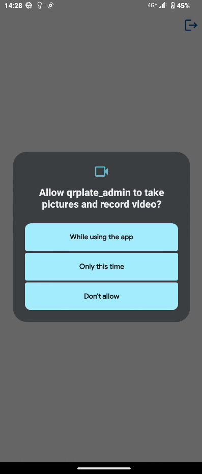
*Camera permission request*


*Scanning student QR codes*


*QR scan result*