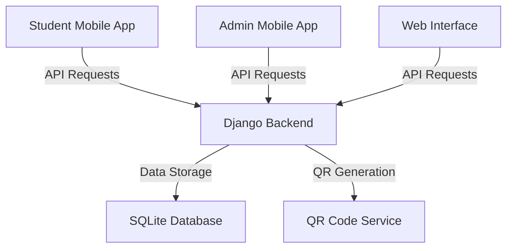

# QRPlate Technical Documentation

## Table of Contents
1. [System Architecture](#system-architecture)
2. [Technical Specifications](#technical-specifications)
3. [API Documentation](#api-documentation)
4. [User Manual](#user-manual)
5. [Setup Instructions](#setup-instructions)
6. [Project Journey](#project-journey)
7. [Team Roles and Contributions](#team-roles-and-contributions)
8. [Challenges and Solutions](#challenges-and-solutions)
9. [Future Work](#future-work)
10. [Lessons Learned](#lessons-learned)

## System Architecture

### Overview
QRPlate is a comprehensive dining management system for the African Leadership University, consisting of three main components:
1. Web Backend (Django)
2. Mobile Applications (Flutter)
   - Student App
   - Admin App
3. Database (SQLite)

### System Components Interaction


### Key Features
1. **Authentication System**
   - OTP-based verification
   - Role-based access control
   - Secure session management

2. **QR Code Management**
   - Unique QR code generation per user
   - QR code scanning and validation
   - Real-time attendance tracking

3. **Admin Dashboard**
   - Attendance monitoring
   - Report generation
   - User management
   - Issue tracking

## Technical Specifications

### Backend Stack
- **Framework**: Django 4.x
- **Database**: SQLite
- **API Framework**: Django REST Framework
- **Authentication**: Django Authentication System
- **QR Code Generation**: Python QR Code Library

### Frontend Stack
- **Web**: HTML5, CSS3, JavaScript
- **Mobile**: Flutter
- **State Management**: Provider (Flutter)
- **UI Components**: Material Design

### Main Dependencies
```python
# Backend Dependencies
Django==4.x
djangorestframework==3.x
qrcode==7.x
pillow==9.x
django-cors-headers==4.x

# Mobile Dependencies
flutter:
  qr_code_scanner: ^1.x
  http: ^1.x
  shared_preferences: ^2.x
  provider: ^6.x
```

## API Documentation

### Base URL
```
https://qrplate.pythonanywhere.com/api/
```

### Authentication

#### Login
```http
POST /api/login/
Content-Type: application/json

{
    "email": "student@gmail.com"
}
```

**Response:**
```json
{
    "message": "OTP sent to your email.",
    "sessionId": "session_key"
}
```

#### Send OTP
```http
POST /api/send-otp/
Content-Type: application/json

{
    "email": "student@gmail.com",
    "sessionId": "session_key"
}
```

**Response:**
```json
{
    "message": "OTP sent to your email.",
    "sessionId": "session_key"
}
```

#### Verify OTP
```http
POST /api/verify-otp/
Content-Type: application/json

{
    "otp": "123456"
}
```

**Response:**
```json
{
    "message": "Login successful.",
    "user": {
        "email": "student@gamil.com",
        "first_name": "John",
        "last_name": "Doe"
    },
    "tokens": {
        "access": "eyJhbGciOiJIUzI1NiIsInR5cCI6IkpXVCJ9...",
        "refresh": "eyJhbGciOiJIUzI1NiIsInR5cCI6IkpXVCJ9..."
    }
}
```

#### Admin Login
```http
POST /api/admin-login/
Content-Type: application/json

{
    "username": "admin",
    "password": "admin_password"
}
```

**Response:**
```json
{
    "message": "Login successful",
    "access": "eyJhbGciOiJIUzI1NiIsInR5cCI6IkpXVCJ9...",
    "refresh": "eyJhbGciOiJIUzI1NiIsInR5cCI6IkpXVCJ9..."
}
```

### User Management

#### Sign Up
```http
POST /api/signup/
Content-Type: application/json

{
    "email": "student@gmail.com",
    "password": "secure_password",
    "first_name": "John",
    "last_name": "Doe",
    "student_id": "ALU123456",
    "phone": "+250789123456"
}
```

**Response:**
```json
{
    "message": "User created successfully.",
    "user": {
        "email": "student@gmail.com",
        "username": "student",
        "first_name": "John",
        "last_name": "Doe",
        "student_id": "ALU123456"
    }
}
```

#### Get Home Data
```http
GET /api/home-api/
Authorization: Bearer <token>
```

**Response:**
```json
{
    "qr_code": "base64_encoded_qr_image",
    "user_profile": {
        "email": "student@gmail.com",
        "student_id": "ALU123456",
        "first_name": "John",
        "last_name": "Doe"
    },
    "qr_code_url": "https://qrplate.pythonanywhere.com/scan/{qr_code_id}",
    "profile_picture_url": "https://qrplate.pythonanywhere.com/media/profile_pictures/image.jpg"
}
```

#### Update Profile Picture
```http
POST /api/update-profile-picture/
Authorization: Bearer <token>
Content-Type: multipart/form-data

{
    "profile_picture": <file>
}
```

**Response:**
```json
{
    "message": "Profile picture updated successfully",
    "profile_picture_url": "https://qrplate.pythonanywhere.com/media/profile_pictures/image.jpg"
}
```

### Attendance

#### Mark Attendance
```http
POST /api/mark-attendance/
Authorization: Bearer <token>
Content-Type: application/json

{
    "qr_code_id": "uuid_string"
}
```

**Response:**
```json
{
    "message": "Attendance marked successfully."
}
```

#### Scan QR Code
```http
POST /api/scan/{qr_code_id}/
Authorization: Bearer <token>
```

**Response:**
```json
{
    "message": "Attendance successfully recorded for {username}.",
    "attendance_time": "12:00:00"
}
```

### Dashboard

#### Student Dashboard
```http
GET /api/student-dashboard/
Authorization: Bearer <token>
```

**Response:**
```json
{
    "attendance_records": [
        {
            "date": "2024-03-30",
            "status": "present"
        }
    ]
}
```

#### Admin Dashboard
```http
GET /api/admin-dashboard/
Authorization: Bearer <token>
```

**Response:**
```json
{
    "user_profiles": [
        {
            "email": "student@gmail.com",
            "student_id": "ALU123456",
            "attendance_count": 45
        }
    ]
}
```

### Token Management

#### Refresh Token
```http
POST /api/token/refresh/
Content-Type: application/json

{
    "refresh": "refresh_token"
}
```

**Response:**
```json
{
    "access": "new_access_token"
}
```

### Error Responses

All endpoints may return the following error responses:

#### 400 Bad Request
```json
{
    "message": "Invalid input data",
    "errors": {
        "field": ["error message"]
    }
}
```

#### 401 Unauthorized
```json
{
    "message": "Authentication required"
}
```

#### 403 Forbidden
```json
{
    "message": "User is not authorized"
}
```

#### 404 Not Found
```json
{
    "message": "Resource not found"
}
```

#### 500 Internal Server Error
```json
{
    "message": "Internal server error"
}
```

### Authentication Requirements

- Most endpoints require JWT authentication using Bearer token
- Admin endpoints require staff user privileges
- OTP endpoints are rate-limited to prevent abuse
- Tokens expire after 5 minutes (access) and 24 hours (refresh)

## User Manual

### Student App
1. **Registration**
   - Download the student app
   - Enter student details
   - Verify email with OTP
   - Complete profile setup

2. **Using the App**
   - View your QR code
   - Check attendance history
   - Report issues
   - View meal schedule

### Admin App
1. **Setup**
   - Download the admin app
   - Login with admin credentials
   - Configure scanning settings

2. **Daily Operations**
   - Scan student QR codes
   - Monitor attendance
   - Generate reports
   - Handle issues

## Setup Instructions

### Local Development Setup
1. **Backend Setup**
   ```bash
   git clone https://github.com/Bonaparte003/QRPlate.git
   cd QRPlate/QR_Backend
   python -m venv venv
   source venv/bin/activate  # or `venv\Scripts\activate` on Windows
   pip install -r requirements.txt
   python manage.py migrate
   python manage.py createsuperuser
   python manage.py runserver
   ```

2. **Mobile App Setup**
   ```bash
   cd QRApps/qrplate  # or qrplate_admin for admin app
   flutter pub get
   flutter run
   ```

### Production Deployment
1. **Backend Deployment**
   - Set up a production server
   - Configure environment variables
   - Set up SSL certificates
   - Deploy using Gunicorn and Nginx

2. **Mobile App Deployment**
   - Generate release builds
   - Sign the APK/IPA files
   - Deploy to app stores

## Project Journey

### Milestones
1. **Planning Phase**
   - Requirements gathering
   - System design
   - Technology stack selection

2. **Development Phase**
   - Backend development
   - Mobile app development
   - Integration testing


3. **Deployment Phase**
   - Production deployment
   - User training
   - System monitoring

## Team Roles and Contributions

### Team Structure
1. **Bonaparte Uteramahoro**
   - Mobile App Development Lead
   - Flutter implementation
   - UI/UX design

2. **Anjeline Noel**
   - System Development & Security Lead
   - Database architecture
   - Security implementation

3. **Uwambaje Eddy**
   - Web App Frontend Lead
   - Web interface development
   - Frontend optimization

4. **Birenzi David**
   - System Development & Backend Lead
   - Backend infrastructure
   - API development

## Challenges and Solutions

### Technical Challenges
1. **QR Code Scanning Reliability**
   - Challenge: Inconsistent scanning in low-light conditions
   - Solution: Implemented adaptive brightness and contrast

2. **Offline Functionality**
   - Challenge: Limited internet connectivity
   - Solution: Implemented local storage and sync mechanisms

3. **Security Concerns**
   - Challenge: QR code spoofing
   - Solution: Implemented time-based validation and encryption

## Future Work

### Planned Enhancements
1. **Feature Additions**
   - Meal planning system
   - Payment integration
   - Analytics dashboard

2. **Technical Improvements**
   - Migration to PostgreSQL
   - Real-time notifications
   - Enhanced security features

3. **User Experience**
   - Dark mode support
   - Offline-first architecture
   - Performance optimization

## Lessons Learned

### Technical Insights
1. **Architecture Decisions**
   - Importance of modular design
   - Value of comprehensive testing
   - Need for scalable solutions

2. **Development Process**
   - Agile methodology benefits
   - Regular code reviews importance
   - Documentation value

3. **User-Centric Approach**
   - User feedback importance
   - Iterative development benefits
   - Accessibility considerations

### Best Practices Established
1. **Code Quality**
   - Consistent coding standards
   - Regular refactoring
   - Comprehensive documentation

2. **Security**
   - Regular security audits
   - Data encryption
   - Access control

3. **Performance**
   - Optimization techniques
   - Caching strategies
   - Resource management 
